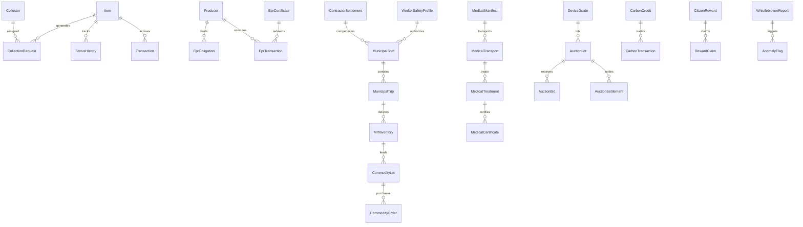

# CirculaSync / EcoTrack 360 — Technical Architecture Specification

> **A Unified Circular Economy, Multi-Stream Waste Traceability & Statutory Compliance Platform**  
> *Engineered for Smart India Hackathon (SIH) — Aligning with CPCB E-Waste (2022), Solid Waste (2016), and Biomedical Waste (2016) Rules.*

---

## 1. Executive Summary & Vision

India generates over **62 million tonnes of municipal solid waste (MSW)**, **1.71 million tonnes of e-waste**, and **600+ tonnes/day of biomedical waste (BMW)** annually. The primary bottlenecks across urban and industrial waste management are:
1. **Siloed & Fragmented Systems:** Lack of unified tracking across municipal, electronic, and clinical waste.
2. **Leakage & Illegal Dumping:** Unverified handovers, missing chain-of-custody, and informal scrap disposal.
3. **Regulatory Non-Compliance:** Burdensome manual CPCB/SPCB statutory reporting (Forms 2, 4, and IV).
4. **Economic Inefficiency:** Inability to monetize recovered secondary commodities (rare metals, compost, plastics) or carbon credits.

**CirculaSync / EcoTrack 360** resolves these systemic failures through a modular **7-Phase Distributed Architecture** powered by Node.js, Express, Prisma ORM, Neon Cloud PostgreSQL, cryptographic Merkle audit trees, and edge AI vision algorithms.

---

## 2. Multi-Stream Circular Economy Framework

The platform natively models three statutory waste tracks under distinct Indian environmental regulatory regimes:

```mermaid
flowchart TD
    subgraph Stream1["Stream 1: E-Waste Rules (2022)"]
        EW1["Citizen E-Waste Registration"] --> EW2["AI Forensic Vision Diagnostic"]
        EW2 --> EW3["Precious Metals Harvesting (Au, Ag, Cu)"]
        EW3 --> EW4["Reverse Auction Engine"]
        EW4 --> EW5["EPR Certificate Minting & Trading"]
    end

    subgraph Stream2["Stream 2: Solid Waste SWM Rules (2016)"]
        MSW1["Door-to-Door Collection"] --> MSW2["Eulerian Snake Route (Zero-Skipped)"]
        MSW2 --> MSW3["Weighbridge & MRF Sorting"]
        MSW3 --> MSW4["Compost Offtake & B2B Recyclables"]
        MSW4 --> MSW5["User-Fee Invoicing & Swachh Score"]
    end

    subgraph Stream3["Stream 3: Biomedical BMW Rules (2016)"]
        BMW1["Hospital Color Segregation (Yellow/Red/Blue/White)"] --> BMW2["GPS-Barcoded Digital Manifest"]
        BMW2 --> BMW3["Dedicated Bio-Hazard Transport"]
        BMW3 --> BMW4["Autoclave / Incineration Verification"]
        BMW4 --> BMW5["Tamper-Proof Destruction Certificate"]
    end

    Stream1 --> CoreEngine["Central Decision & Regulatory Engine"]
    Stream2 --> CoreEngine
    Stream3 --> CoreEngine

    CoreEngine --> MerkleChain["Cryptographic Merkle Audit Tree"]
    CoreEngine --> PostgresDB["Neon Cloud PostgreSQL Database"]
    CoreEngine --> CPCBReport["Automated CPCB / SPCB Statutory Returns"]
```



---

## 3. High-Level System Architecture

```mermaid
graph TD
    ClientTier["Client Tier: 8 Dedicated Portals"]
    ClientTier --> Landing["/ (Unified Landing)"]
    ClientTier --> UserPortal["/user (Citizen & Rewards)"]
    ClientTier --> CollectorPortal["/collector (Intake & AI Scanner)"]
    ClientTier --> GovPortal["/government (CPCB / SPCB Command)"]
    ClientTier --> ProducerPortal["/producer (EPR & ESG Offsets)"]
    ClientTier --> MunicipalPortal["/municipal (SWM & Snake Routes)"]
    ClientTier --> MedicalPortal["/medical (BMW Healthcare Facility)"]
    ClientTier --> TrackPortal["/track/:token (Public Digital Passport)"]

    Gateway["Express.js API Gateway & RBAC Layer"]
    Landing & UserPortal & CollectorPortal & GovPortal & ProducerPortal & MunicipalPortal & MedicalPortal & TrackPortal --> Gateway

    subgraph EngineTier["Modular Engine Tier (ES Modules)"]
        Gateway --> DecisionEngine["decisionEngine.mjs (State Machine)"]
        DecisionEngine --> RouteEngine["routeEngine.mjs (Snake & TSP)"]
        DecisionEngine --> CreditEngine["creditEngine.mjs (Eco-Wallets)"]
        DecisionEngine --> EPREngine["eprEngine.mjs (EPR Certificates)"]
        DecisionEngine --> MunicipalEngine["municipalEngine.mjs (MRF & Trips)"]
        DecisionEngine --> MedicalEngine["medicalEngine.mjs (BMW Chain)"]
        DecisionEngine --> AuctionEngine["auctionEngine.mjs (Reverse Auctions)"]
        DecisionEngine --> ComplianceEngine["complianceEngine.mjs (Swachh & Fee)"]
        DecisionEngine --> ESGEngine["esgEngine.mjs (VCC Carbon Offsets)"]
        DecisionEngine --> CommunityEngine["communityEngine.mjs (Forecasting & Safety)"]
        DecisionEngine --> RegulatoryEngine["regulatoryEngine.mjs (Merkle & CPCB)"]
        DecisionEngine --> EdgeEngine["edgeOperationsEngine.mjs (Vision & Hazmat)"]
    end

    subgraph DataTier["Data Persistence Tier"]
        EngineTier --> PrismaORM["Prisma ORM (v5.22)"]
        PrismaORM --> NeonDB["Neon Cloud PostgreSQL (ep-blue-truth-pooler)"]
        EngineTier --> BackupDB["JsonBackupDatabase & Local Snapshot Mirror"]
    end
```



---

## 4. Phase-by-Phase Technical Breakdown

### Phase 1: Core E-Waste & Municipal Logistics
* **Dynamic Collector Allocation:** Deterministic matching using the least-loaded algorithm, district proximity filtering, and facility capacity guarding.
* **Environmental Impact Calculator:** Real-time GHG emissions avoidance, energy conserved, and toxic landfill diversion calculations mapped to CPCB material life cycle factors.
* **Public Digital Passport (`/track/:token`):** PII-masked, tamper-evident digital tracking passport accessible via dynamic QR code.

### Phase 2: Refurbishment & Precious Metals Reverse Auction
* **Standardized Sorting Quality Index (SSQI):** AI physical condition grading (A/B/C/D) evaluating screen integrity, battery swelling, board corrosion, and salvage potential.
* **Intrinsic Precious Metal Valuation:** Real-time extraction valuation based on intrinsic yields of Gold (Au), Silver (Ag), Copper (Cu), and Palladium (Pd) per device category.
* **English Reverse Auction Engine:** 5-minute bidding rounds with minimum bid increments, real-time bid validation, automated closing, and lot settlement.

### Phase 3: Swachh Compliance, Compost Offtake & Anomaly Detection
* **SWM Rule 2016 Compliance Engine:** Real-time compliance monitoring across wet/dry/domestic-hazardous waste streams.
* **Swachh Survekshan Scorecard:** 100-point composite index based on segregation ratios, processing turnaround, and citizen satisfaction.
* **Compost Offtake Module:** Quality grade certification (FCO compliance), moisture tracking, bulk lot booking, and agricultural offtake verification.
* **Property Tax & User-Fee Billing:** Ward-level volumetric billing calculation, automated penalty generation, and payment ledger.
* **Automated Anomaly Scanner:** Flags payload discrepancies between collection vehicles and MRF weighbridge scale readings.

### Phase 4: Multi-Track ESG Engine & Voluntary Carbon Credit (VCC) Marketplace
* **Multi-Track GHG Abatement Modeling:**
  * *E-Waste Recycling:* Avoided virgin mining and smelting emissions.
  * *Municipal Composting:* Methane ($CH_4$) landfill emissions abatement.
  * *Biomedical Waste Autoclaving:* High-efficiency sterilization vs. open incineration.
* **Voluntary Carbon Credit (VCC) Minting:** Converts verified metric tons of $CO_2$ avoided into tradable digital carbon offset credits.
* **Corporate ESG Marketplace:** Enables corporate enterprises to purchase verified offsets, retire carbon credits, and download auditable ESG retirement certificates.
* **Contractor Settlement Reconciliation:** Automated per-ton hauling and processing rate calculations, deductions for contamination, and SLA settlement disbursements.

### Phase 5: Citizen Whistleblower, AI Forecasting, Recyclables Exchange & Worker Safety
* **Anonymous Geotagged Whistleblower Reporting:** Secure citizen incident reporting with cryptographic tracking tokens, municipal dispatching, and resolution proofs.
* **ARIMA-Style Influx Forecasting:** Moving-average trend analysis forecasting incoming waste volumes by ward and material type.
* **B2B Secondary Materials Marketplace:** Trade recycled commodities (rPET, HDPE flakes, aluminium ingots, shredded cardboard) with automated GST invoicing.
* **Sanitation Worker Safety & Health Passport:** Health profiling tracking Tetanus and Hepatitis-B vaccination validity, PPE distribution, and hazardous exposure compliance.

### Phase 6: CPCB/SPCB Statutory Returns & Merkle Root Cryptographic Audit Chain
* **Automated Statutory Return Generator:**
  * **CPCB Form-4:** Annual E-Waste Recycling & Refurbishment Return.
  * **SWM Form-2:** Annual Municipal Solid Waste Implementation Report.
  * **BMW Form-IV:** Annual Biomedical Waste Generation & Disposal Report.
* **Cryptographic Merkle Root Audit Trail:** Hashes all transactions into SHA-256 Merkle trees. Generates mathematical Merkle inclusion proofs ensuring immutability.
* **Real-Time Fleet GPS Telemetry:** Live simulation and tracking of collection vehicles, route adherence alerts, and geofence monitoring.
* **System & Database Health Diagnostics:** Real-time pool latency checks, connection health, and table row count diagnostics.

### Phase 7: Edge AI Vision Inspector, Snake Route Optimizer, HAZMAT Lockdown & Offline PWA Sync
* **Edge AI Vision Conveyor Inspector:** Simulates continuous optical scanning of waste streams, computing real-time SSQI purity scores, identifying hazardous contaminants (e.g., lithium-ion batteries), and triggering sorting actuator gate commands (`DIVERT_TO_HAZARDOUS`, `PASS_SORTED`, `REJECT_STREAM`).
* **Eulerian Snake Route Optimizer (Zero-Skipped Streets):** Implements a Eulerian Circuit algorithm (Chinese Postman Problem variant) ensuring 100% street coverage without missing alleys or unserviced lanes.
* **HAZMAT Emergency Containment & Lockdown:** Instantly isolates biohazard, radiation, or toxic chemical spills with a 4-digit perimeter lockdown code, protocol checklist generation, and multi-channel SMS/WhatsApp alerts.
* **Offline-First PWA Sync Queue:** Employs client-side sync queue with cryptographic hashes, resolving network disconnections with replay-free reconciliation.

---

## 5. Database Schema & Data Persistence

The platform utilizes a dual-tier persistence layer:
1. **Neon Cloud PostgreSQL (`neondb`):** Managed PostgreSQL cluster with connection pooling (`ep-blue-truth-b5d9ycvi-pooler.c-7.us-east-2.aws.neon.tech`).
2. **Local & Cloud Backup Database Mirror (`JsonBackupDatabase`):** Flat-file storage with automated periodic database backups preserving all 53 domain entities with SHA-256 integrity verification.



---

## 6. Cryptography, Security & Verification Standards

* **Merkle Root Verification:** Every batch of manifests and transactions is hashed into a binary SHA-256 Merkle tree. Audits can prove record membership in $O(\log N)$ time without disclosing other records.
* **Role-Based Access Control (RBAC):** Server-side token validation enforcing strict permissions across roles: `CITIZEN`, `COLLECTOR`, `PRODUCER`, `MUNICIPAL`, `MEDICAL`, `GOVERNMENT`, and `ADMIN`.
* **Zero PII Exposure on Public Passports:** The public QR route (`/track/:token`) obscures sensitive names (`ra***`) and precise household locations while presenting full supply chain provenance.

---

## 7. Complete REST API Directory

| Domain | Method | Endpoint | Description |
| :--- | :---: | :--- | :--- |
| **Core** | `POST` | `/api/items` | Register new e-waste item |
| | `GET` | `/api/items/:id` | Fetch item details & passport journey |
| | `POST` | `/api/requests` | Create collection request (auto-assigned) |
| | `GET` | `/api/collector/:id/route` | Compute TSP route optimization for collector |
| **Auctions** | `POST` | `/api/auction/grade` | Submit AI diagnostic condition grade |
| | `POST` | `/api/auction/lots` | Aggregate graded inventory into auction lot |
| | `POST` | `/api/auction/bids` | Submit real-time bid on active lot |
| | `POST` | `/api/auction/settle` | Settle closed auction with highest bidder |
| **SWM Municipal** | `POST` | `/api/municipal/shifts` | Dispatch municipal sanitation shift |
| | `POST` | `/api/municipal/trips/lock` | Lock weighbridge payload & gross weight |
| | `GET` | `/api/compliance/swachh-score`| Calculate ward Swachh Survekshan score |
| | `GET` | `/api/compliance/compost` | Fetch compost offtake batches & FCO specs |
| **Biomedical (BMW)**| `POST` | `/api/medical/manifests` | Create color-coded biohazard manifest |
| | `POST` | `/api/medical/treatment` | Log autoclave / incineration parameters |
| | `GET` | `/api/medical/certificates`| Retrieve tamper-proof destruction proofs |
| **ESG & Carbon** | `GET` | `/api/esg/carbon-offsets` | Calculate multi-track $CO_2$ abatement |
| | `POST` | `/api/esg/credits/mint` | Mint verified voluntary carbon credits (VCC) |
| | `POST` | `/api/esg/credits/purchase`| Corporate retirement of carbon credits |
| **Regulatory** | `GET` | `/api/regulatory/cpcb/form-4` | Generate CPCB E-Waste Annual Return |
| | `GET` | `/api/regulatory/cpcb/form-5` | Generate SWM Annual Municipal Return |
| | `GET` | `/api/regulatory/audit/merkle-chain` | Retrieve Merkle root cryptographic chain |
| | `GET` | `/api/regulatory/fleet/telemetry` | Real-time vehicle GPS positions & alerts |
| **Edge & Hazmat** | `POST` | `/api/edge/vision-inspect` | Real-time conveyor AI purity inspection |
| | `POST` | `/api/edge/routes/snake` | Compute zero-skipped Eulerian snake route |
| | `POST` | `/api/edge/hazmat/trigger` | Activate emergency hazardous lockdown |
| | `POST` | `/api/edge/sync/flush` | Reconcile offline-queued field transactions |

---

## 8. Quality Assurance & Verification

The platform maintains a **100% passing test suite** encompassing **85 automated unit and end-to-end integration tests**:
```bash
node --test --test-concurrency=1 tests/*.test.mjs
```
* **Coverage Scope:** Auction lifecycles, Eulerian circuit validity, CPCB return calculations, Merkle proof verification, AI vision triage gating, tamper-proof EPR certificate minting, and offline sync replay safety.

---

## 9. Production Deployment, PWA & Operational Tooling

### Docker Containerization
The system is fully containerized using multi-stage Alpine Linux images:
```bash
# Build & start entire stack via Docker Compose
docker compose up -d

# Check live container health
docker ps
```

### Progressive Web App (PWA) Offline Engine
* **Service Worker (`public-shared/sw.js`):** Intercepts client requests with a Stale-While-Revalidate caching strategy for UI assets and Leaflet maps.
* **Background Sync Reconnection:** Listens for browser `sync` events to flush queued offline transactions (`/api/edge/sync/flush`) to Neon PostgreSQL without data loss.

### Zero-Scroll Cockpit User Interface
* **Government Command Hub:** Reorganized into 5 discrete workspaces (`Overview`, `Fleet`, `CPCB`, `Audit`, `Safety`) eliminating vertical scrolling and providing an automated 5-step Jury Demo Tour.
* **Citizen Portal:** 4 focused workspaces with automated demo profile loading (`rahul123`).
* **Landing Page:** Interactive 3-track segment selector fitting within a single screen viewport.

### Operational CLI Commands
| Command | Action |
| :--- | :--- |
| `npm start` | Launch unified Express server on port 3000 |
| `npm run seed` | Populate live demo state across Neon DB & JSON files (`seedDemoData.mjs`) |
| `npm run migrate` | Sync all local domain records into Neon PostgreSQL (`migrateToPostgres.mjs`) |
| `npm run backup` | Mirror all 53 JSON files into Neon DB & local snapshots (`backupToDatabase.mjs`) |
| `npm run db:push` | Synchronize Prisma schema with live Neon PostgreSQL |
| `npm test` | Execute full 85-test regression suite |

